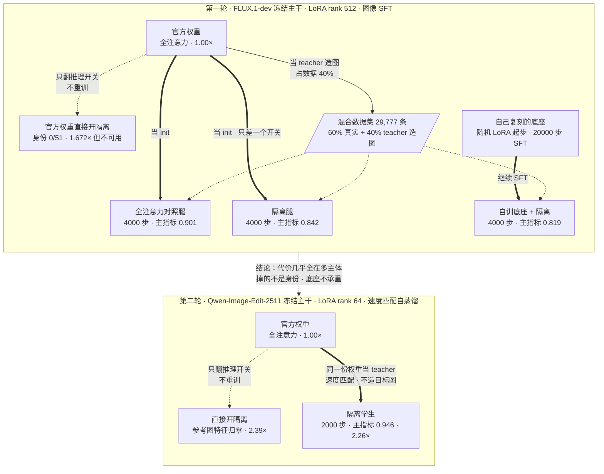

# 隔离注意力 + 参考图 KV 缓存 —— 最终报告

> 两轮实验，2026-07-23 → 2026-08-16。
> 数据口径：全文只用**主指标**与**加速比**两类数字，其余统计量一律不进正文。
> 判据原文与预登记：`distill/M4_EVAL_SPEC.md` §8/§9、`distill/DISTILL_PLAN.md` §11、`qwen/PLAN.md` §4。
>
> **主指标** = `(被检验方胜 + 平局) / (基线胜 + 平局)`，来自单标注者的成对盲评（左右随机摆放，看不到变体名）。
> 它不是概率，可以超过 1。每一批都在同一批里混入「两侧是同一份权重」的锚点，量出这把尺子在这一场里的
> **满分刻度**——实测是 1.000–1.017，不是靠猜是 1.0。**任何一个主指标只跟自己批内的满分刻度比**，
> 跨批次的读数不并排引用。

---

## 0. 一句话

多参考图生成里，参考图的注意力**其实只需要算一次**。改成这样能省掉大部分算力，代价是模型权重不认这个结构、必须重训。整个项目就是在算这笔账。

两轮做完，账是：**2.26× 加速，主指标 0.946（这把尺子的满分刻度是 1.000）。**

---

## 1. 想法：参考图为什么可以只算一次

推理时序列长这样：

```
[  文本  │      噪声图      │   参考图₁   │   参考图₂   │ … ]
   420        4096 token      4096 token    4096 token
```

默认每一步去噪，**整条序列都重算一遍**，包括参考图那几段。但参考图段本来就不该变——它不含噪声，也没有理由去看别人。把它改成两件事同时成立：

- **(a)** 参考图只看自己（注意力掩码，不看文本、不看噪声、不看另一张参考图）；
- **(b)** 参考图段用固定的时间步（t=0），不跟着去噪步走。

这两条一旦同时成立，参考图段的 K/V 就**与去噪步无关**。40 步 × CFG 两支 = 80 次前向里，**算 1 次，读 79 次**。

省下来的是这个：读缓存的那 79 次前向，query 只剩文本+噪声（4516 token），而 key 仍是全长（12708 token），**每层开销降到 36%**。

**代价**：官方权重是在「参考图看得见一切」的前提下训出来的，直接改结构它不认。所以必须重训——这就是要算的那笔账。

---

## 2. 第一轮：在 FLUX 底座上，用 SFT 把能力训回来

### 2.1 训练方法：两段 SFT

主干 `FLUX.1-dev` 全程冻结，训的是 **LoRA rank 512**。分两段：

**第一段 · 复刻底座。** 从随机 LoRA 开始，在 UNO-1M 真实配对数据上做 SFT，20,000 步（8×4090）。这一段是在补官方没开源的东西。

**第二段 · 在混合数据集上继续 SFT。** 数据集 `train_mixed.json` 共 29,777 条：

| 来源 | 条数 | 占比 |
|---|---|---|
| UNO-1M 真实单参考图数据 | 17,866 | 60% |
| **teacher 生成的 2 参考图目标图** | 10,720 | 36% |
| **teacher 生成的 3 参考图目标图** | 1,191 | 4% |

⚠️ **多参考图那 40% 是撑出来的**：唯一样本只有 2,179 条，靠重复采样 5.3×/8.6× 进流。而且这 40% 的**目标图是 teacher 自己生成的**——先用 teacher 造图、人工筛一遍、再拿这些图当监督信号。

这条路线的形状是：**造数据 → 过滤 → 拿图片做 SFT**。它同时在教两件事——「怎么在隔离结构下工作」和「怎么生成好图」。这两件事混在一起，是后面归因困难的根源。

### 2.2 实验 1 —— 不重训，直接开隔离会怎样？

**为什么先做这个**：最便宜（纯推理 25.8 分钟），而且这个组合从没跑过。如果隔离本身代价极大，后面所有设计都要改。

**方法**：官方权重原样不动，只翻推理开关。因为崩坏一眼可辨，偏好比较在这里会失效（每一对都能认出谁是谁），所以改用**客观计数**——给一张生成图和一个参考主体，只问「这个主体的身份保住了吗」，是/否。

**结果**：

| | 身份留存 | 速度 |
|---|---|---|
| 官方权重 · 全注意力 | 45/51 | 1.00× |
| 官方权重 · 直接开隔离 | **0/51** | **1.672×** |

先排除了「管道坏了」：开隔离那一支的**峰值显存反而更高**（参考图 token 确实在序列里），加速比与 KV 基准吻合，零失败零崩坏。

**⇒ 隔离的代价不是一个与权重无关的常数**，它完全由「有没有为隔离重训过」中介。**必须重训**这一条被钉死。

### 2.3 实验 2 —— 重训之后，能追平官方吗？

**方法**：第 2.1 节那两段 SFT 训完，与官方权重成对盲评 227 条。

| | 主指标 |
|---|---|
| **总体** | **0.819** |
| 2 参考图 | 0.770 |
| 1 参考图 | 0.816 |

**⇒ 追不平。** 但这是个**合数**——三件事同时变了（训练数据配方、隔离结构、自己复刻的底座），不知道该记在谁头上。

### 2.4 实验 3–5 —— 把三件事拆开，每次只动一个变量

做法是造一条链，链上每一步**只差一个变量**：

| 只动这一个 | 具体做法 | 主指标 | 批内满分刻度 |
|---|---|---|---|
| 训练数据配方 | 官方权重为起点，**不开隔离**，训同样 4000 步 | 0.901 | 1.017 |
| **隔离结构** | 与上一行**只差一个开关** | **0.842**<br>（2-ref **0.716** / 1-ref 1.122） | **1.000** |
| 底座 | 只把起点从官方权重换成自己复刻的 | 1.007 | 1.000 |

同一批里还做了一次客观身份计数：

| | 身份留存 |
|---|---|
| 隔离腿 | 46/51 |
| 全注意力腿 | 45/51 |
| 官方权重直接开隔离（实验 1 的锚点） | 0/51 |

### 2.5 第一轮收口

- **代价存在，方向确定，几乎全在多主体**：2 参考图主指标 0.716（批内满分是 1.000），1 参考图 1.122——**在单参考图上测不到代价**。
- **掉的不是主体身份**：46/51 与全注意力的 45/51 分不开。丢的是构图、主体间关系、画面质量，这一批分不开是哪一个。
- **底座不承重**：换成自己复刻的底座，主指标 1.007，而该批满分刻度正好 1.000——**点估计贴在天花板上**。
- **训练数据配方本身就有代价**：0.901 对满分 1.017。这一条是 SFT 路线自带的——因为它同时在教「生成好图」，而不只是「在新结构下复现旧行为」。
- 买回来的是 **1.672×**。

---

## 3. 第二轮：换一种训练目标——不造数据，直接对齐 teacher

### 3.1 方法上最大的差别

第一轮是**图像 SFT**：先用 teacher 造目标图、人工过滤、混成数据集，再拿这些**图片**当监督信号。

第二轮换成**速度匹配的自蒸馏**：不造任何目标图，让隔离版的自己去匹配全注意力版的自己**在同一个点上的预测**。

```
teacher = 同一份权重，关掉 LoRA，全注意力，no_grad
student = 同一份权重，开启 LoRA，隔离掩码

L = ‖ v_iso(x_t, t) − v_full(x_t, t).detach() ‖²      只在噪声图 token 位置上取
```

`x₀` 在这里**只用来决定 x_t 落在哪条轨迹上**，监督信号完全来自 teacher 在该点的函数值。

这个改动带来四个直接后果：

| | 第一轮（图像 SFT） | 第二轮（速度匹配自蒸馏） |
|---|---|---|
| 监督信号 | teacher 生成的**图片** | teacher 在同一点的**函数值** |
| 需要造数据吗 | 要：生成 → 人工过滤 → 混数据集 | **不要** |
| 断言目标图好不好 | 要（过滤通过率 34.2%） | **不断言**，所以 9000 条全用、不过滤 |
| 教几件事 | 两件（新结构 + 生成质量） | **一件**（在新结构下复现旧行为） |
| 显存里几份权重 | 两份 | **一份**（LoRA 开关切换身份） |

第三行是关键：因为不断言 `x₀` 好不好，第一轮里那个「配方本身就有代价」的问题在这里**结构上不存在**——teacher 和 student 是同一份权重，目标分布就是 teacher 自己，不存在需要跨越的数据鸿沟。

另一个配套决定：**训练用的时间步 t 从推理实际会走的那 40 个 sigma 网格上取**，不是连续均匀采样。训练分布 = 部署分布。

### 3.2 底座与配置

底座换成 `Qwen-Image-Edit-2511`（20B MMDiT，60 层双流）。选它的工程理由是第 1 节那两个条件里的 **(b) 在它上面是原生的**——参考图段固定 t=0 调制是模型自带的，不需要我们改，所以隔离是**精确**的而不是近似的。

| | |
|---|---|
| 可训参数 | LoRA rank 64，188.7 M（8 个注意力投影） |
| 训练数据 | 9000 条（1-ref 1000 / 2-ref 4000 / 3-ref 4000），**不过滤** |
| 步数 | 2000 步，8×H800，386.4 min，11.6 s/it |
| 峰值显存 | 50.8 GB |
| loss | 0.0034 → ~0.0015 |
| 数据切分 | 参考主体只能来自 train 20 个，held-out 10 个**启动即断言**，泄漏就退出 |

**为什么 3 参考图也进训练集**：掩码的扰动强度随参考图段长度单调涨（1-ref 是 4096 token，3-ref 是 12288）。只拿 1/2-ref 训然后在 3-ref 上部署，等于在改动最大的那个维度上外推。先探过底座：官方 teacher 在 3 参考图上的人工通过率 **73.0%**，与 2 参考图的 75.0% 持平——第一轮那个 teacher 是从 51.0% 掉到 3.5% 的，这次没掉。

### 3.3 结果

三个变体，同一批、同一 seed、同一推理口径（40 步 / CFG 4.0 / 1024²），各 240 张：

| | 主指标 |
|---|---|
| **隔离学生 vs 官方全注意力** | **0.946** |
| ├ 2 参考图 | 0.914 |
| └ 1 参考图 | 1.014 |
| **满分刻度**（两侧逐位相同的图，30 对） | **1.000** |

另一支「不重训直接开隔离」的，生成图里**根本看不到参考图的特征**——与第一轮实验 1 的 0/51 是同一个现象，在新底座上原样复现。（目视判定，非盲，未进盲评，故不给数字。）

### 3.4 买回来的：加速比

240 条中位耗时（同机 8 并发，与官方全注意力同批测）：

| | 1 参考图 | 2 参考图 |
|---|---|---|
| 官方全注意力 | 38.6 s/img（1.00×） | 67.3 s/img（1.00×） |
| 不重训直接开隔离 | 22.9 s/img（1.69×） | 28.2 s/img（**2.39×**） |
| **隔离学生** | 24.7 s/img（1.56×） | 29.8 s/img（**2.26×**） |

学生比不重训那一支慢一点，是 LoRA 的额外矩阵乘——这部分是真实成本，不是噪声。

---

## 4. 加速比外推到 5 张参考图

**只到 2 参考图是实测的，3 张以上没出过图。**这一节全是外推。

### 4.1 模型

用第 1 节那笔账：

```
序列长      L(n) = 420(文本) + 4096(噪声) + 4096n(参考图)
每层开销比  r(n) = 4516 / L(n)          ← 读缓存时 query 只剩文本+噪声
总加速      S(n) = 80 / (1 + 79·r(n))   ← 1 次全量写 + 79 次省算读
```

这个模型复算 2 参考图的理论值是 **2.75×**，与出图前写死的预登记值 2.74× 吻合——**模型是对的**。当初预测失手（预登记写的是实测 1.9–2.0×，实际 2.39×/2.26×）是因为折算系数借错了：直接搬了第一轮的 `1.672/2.33 = 0.72`，而本栈实测是 **0.88（不重训）/ 0.82（学生）**。

### 4.2 外推表

| 参考图张数 | 序列长 | 理论 | **隔离学生外推** | 峰值显存 |
|---|---|---|---|---|
| 1 | 8.6k | 1.89× | 1.56×（实测） | 64.1 GB（实测） |
| 2 | 12.7k | 2.75× | 2.26×（实测） | 67.1 GB（实测） |
| 3 | 16.8k | 3.60× | **2.97×** | ~70.0 GB |
| 4 | 20.9k | 4.43× | **3.65×** | ~73.0 GB |
| 5 | 25.0k | 5.24× | **4.32×** | ~75.9 GB |

**显存那一列的斜率是实测的**：每多一张参考图，开缓存的两支峰值 **+2.96 GB**；官方全注意力那支是 **+0.01 GB**（它不缓存，不占这份内存）。与理论对得上——`4096 token × 3072 维 × K/V 两份 × 60 层 × 2 字节 ≈ 3.02 GB`。

### 4.3 三条不许说过头

1. **折算系数只有两个点（1/2 参考图）拟出来的**，外推到 5 张是 2.5 倍外插；kernel 选择、显存带宽在更长序列上会不会拐弯，没测过。
2. **加速比外推不含任何质量断言。** 3 张及以上参考图一张图都没出过，质量代价完全未知。
3. **显存的线性只在 KV 缓存这一项上成立**，不含长序列注意力本身的中间激活。

---

## 5. 两轮并排

同一形状的比较——**隔离+缓存的学生 vs 全注意力官方权重**：

| | 训练方法 | 主指标（总体） | 2 参考图 | 加速 |
|---|---|---|---|---|
| 第一轮 | 两段图像 SFT（含 40% teacher 造图） | 0.819 | 0.770 | 1.672× |
| **第二轮** | **速度匹配自蒸馏，不造数据** | **0.946** | **0.914** | **2.26×** |

第二轮训练量还小一个量级以上：**rank 512 / 24,000 步 → rank 64 / 2,000 步**。

⚠️ **这两个数不能当同一把尺子相减。** 跨批次的读数禁止并排引用，而且两轮同时换了训练目标**和**底座，所以这个改善不能全部记在训练目标上。能站住的说法是：**各自离自己批内满分刻度（1.017 / 1.000）的距离，第二轮明显更近。**

---

## 6. 边界与没闭合的

**判据**：第二轮的预登记达标判据**判据不适用**——它要求非平局样本 ≥ 94，实测 44。按预登记，样本不足时结论是「判据不适用」而不是「不达标」，且不许事后追加样本。**这是关于尺子长度的陈述，不是关于模型的。**

**尺子**：
- 单标注者，只有自洽率，没有标注者间一致性。
- 「不重训直接开隔离」在第二轮是**目视判定、非盲**。
- 蒸馏目标由官方全注意力 teacher 定义，目标分布对基线那一侧天然有利。

**没做的**：
- 第二轮的客观身份留存计数**没做**（第一轮做了两次）。
- 3 张及以上参考图**没出过图**——第 4 节全部是外推。
- 第二轮只训了 2000 步，没有做步数扫描，不知道再训会不会更好。

**已知但没解释的**：两支开缓存的臂各有约 14/75 张单参考图耗时 85–140 s（中位是 22.9/24.7 s），集中在同一段任务；中位数稳健，均值被拉高。

---

## 7. 血缘图



> 粗实线 = 训练产生新权重；细虚线 = 只换配置或只喂数据。

---

## 8. 附：一个额外发现 —— 缓存对文本内容免疫，但对文本长度敏感

出图之前先验了一遍缓存本身有没有错（图全出完才发现缓存是坏的，那批图全废）。做法是三支探针，把每一层缓存的 K/V 与首次写入的值逐位比对：

| 探针 | 变的是什么 | 逐位相同的层数 |
|---|---|---|
| A 复放同一次前向 | 什么都不变 | **60/60** |
| C 换文本**内容**（长度不变） | 文本语义 | **60/60** |
| B 换文本**长度**（412 → 420 token） | 序列长度 | **1/60** |

A 证明探针本身成立；C 证明参考图段对文本**内容**完全免疫——隔离掩码确实生效；B 只有长度变了，却几乎全层都不同。

**这不是泄漏，是浮点求和顺序。** 被掩掉的列贡献的是精确的 `0·v`，但它们仍然占着累加通道；长度一变，同样的参考图数值落进不同的通道，加法顺序就变了，而浮点加法不满足结合律。bf16 的相对精度约 3.9e-3，逐层放大 60 层足够解释观测到的偏差量级。

本地用 CPU 单独验过这个机制：在一个求和前面垫 5 个零会改变结果，垫 1 个或 42 个都不会——**非单调**正是累加通道对齐的签名，而不是数值大小的效应。

**⇒ 缓存是对的。**实测每张图 **1 次写、79 次读**。

这条对以后有用：**只要文本长度不变，参考图的 K/V 缓存可以跨请求复用**；长度一变就必须重算——不是因为结果错，而是因为拿不到逐位一致，没法再声称缓存是无损的。

---

## 9. 数据来源

| 内容 | 出处 |
|---|---|
| 第一轮全部读数与叙事 | `distill/OVERVIEW.md` §4；原始判据 `distill/DISTILL_PLAN.md` §11 |
| 第一轮判据与身份计数口径 | `distill/M4_EVAL_SPEC.md` §8 / §9 |
| 第二轮预登记（判据 + 速度预测） | `qwen/PLAN.md` §4 |
| 第二轮训练目标与配置 | `qwen/train_iso.py`；`reports/20260813-p2-run/REPORT.md` |
| 缓存正确性探针 | `qwen/diag_kv.py`；`output/p3_diag_kv/diag_kv.json` |
| 第二轮出图与加速比 | `reports/20260814-p3-eval/REPORT.md`；`output/p3_*/results.json` |
| 第二轮盲评原始数据 | `output/p3_eval/pairs_p3.json` + `blind_annotations_p3.json`；`reports/20260815-p3-blind/REPORT.md` |
| 统计口径的唯一实现 | `distill/blind_eval/report.py` |
